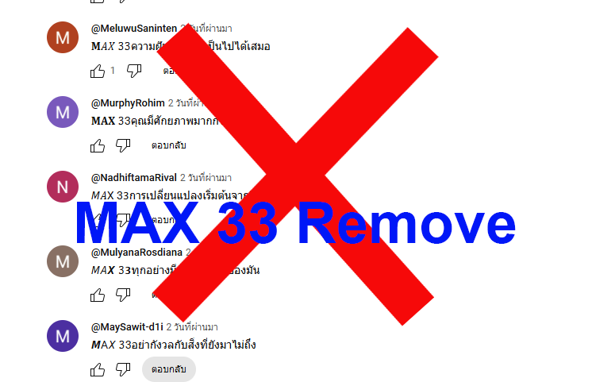
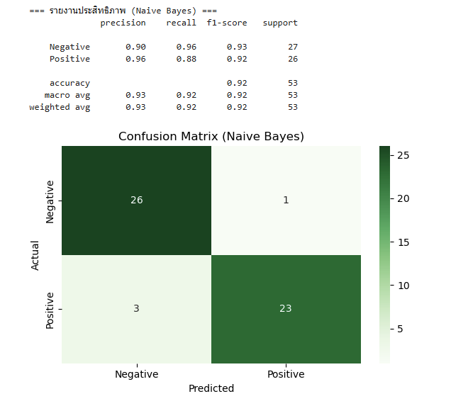
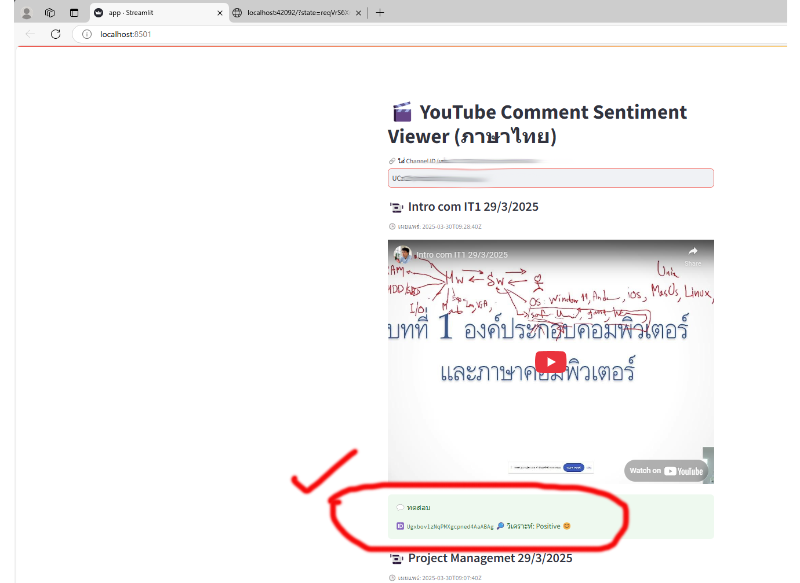

### Youtube Comment Remove MAX33

Youtube Comment Remove about Gambling (e.g., MAX33) in Thai language
This project utilizes Artificial Intelligence (AI) to analyze the meaning of user comments and determine whether they are related to gambling. The analysis is performed using a Bayesian Networks Model, which has achieved a high overall accuracy rate of 92%.

### Pre-requisites

You need two things for this to work:

1. To setup an OAuth client id in the [Google Developer Console](https://console.cloud.google.com/apis/credentials).
    * You will need to create a project, but you can use an account other than the one you wish to delete comments from if you wish.
    * You will need to configure an OAuth consent screen, just filling in the required stuff should be fine.
    * You will need to add yourself and anyone else that will be using this app as test users.
    * Once you have finished creating the OAuth client config, dowload the secret file, name it `client_secret.json` and place it in the top directory of the repo.
    * Once the OAuth client config is done enable the [Youtube Data API V3](https://console.cloud.google.com/apis/library/youtube.googleapis.com).
    * How to Create client_secret.json
2. Go to Google Cloud Console
    *Create a new project
    *Enable YouTube Data API v3
    *Go to OAuth consent screen and configure it
    *Go to Credentials > Create Credentials > OAuth client ID
    *Select Desktop App and download the client_secret.json file
### Getting Started

### Installation
Ensure your environment is:
- Python >= 3.8
  Install wheel by `pip install wheel`

Then, install the remaining requirements with `pip install -r requirements.txt`.
For the gradio demo, an additional `pip install -r requirements-demo.txt` is required.


1   * Clone this repo into ```max33_remove```:
 ```shell
  $ git  clone https://github.com/aucifer16/max33_remove
 ```
2 * Install dependencies:
 ```shell
  $ pip install -r requirements.txt
 ```
##📁 Required Files
| File | Description | 
|----------|----------|
| app.py    | Main Streamlit app    | 
| requirements.txt   | Python package list  |
| client_secret.json    | OAuth 2.0 credentials from Google Cloud   | 
| sentiment_model.pkl   | Trained sentiment classification model  |
| tfidf_vectorizer.pkl	    | TF-IDF vectorizer used with the model   | 
| requirements.txt   | Python package list  |
## ▶️ Running the App
 ```shell
 .\runapp.bat
 ```
Then open the browser and enter a YouTube Channel ID, e.g.:
Enter Your Channel ID, e.g.: UCzr22Ehy1VrqJfWu3-5r3....
The app will fetch the latest 2 videos, display their comments, analyze sentiment, and delete negative ones automatically.

##  Notes
You must log in with a Google account that owns the channel or the comment in order to delete it

Comments marked as Negative will be deleted automatically once detected

This app is intended for educational/research use
## 👨‍💻 Author & Credits

Developed by [Sittiphong Pornudomthap]([https://github.com/aucifer16/)  
📧 Email: sittiphong@pnru.ac.th 


Special thanks to:
- [PyThaiNLP](https://github.com/PyThaiNLP/pythainlp)
- [Streamlit](https://streamlit.io/)
- [Google APIs Client Library for Python](https://github.com/googleapis/google-api-python-client)
